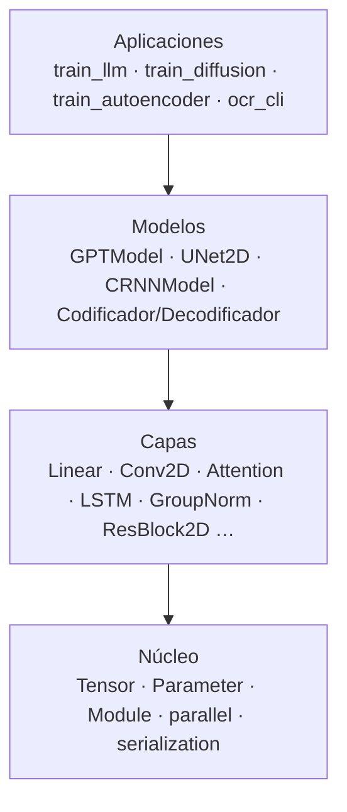
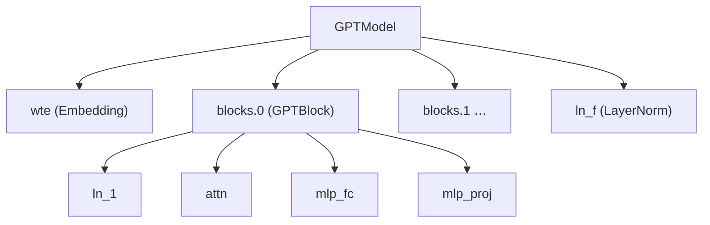
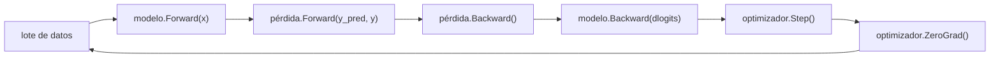
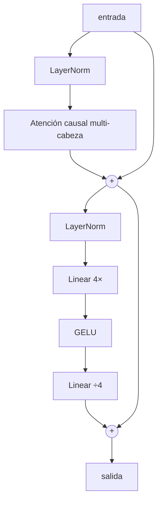
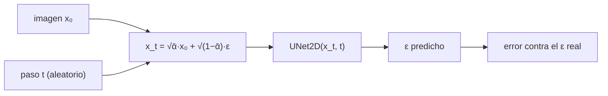
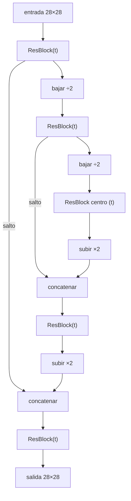
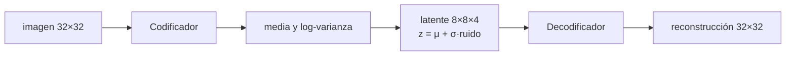
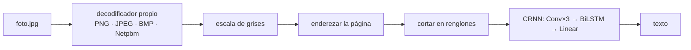

# Arquitectura de NeuralSuite

Cómo encaja todo: desde el tipo que guarda los números hasta un modelo que
genera imágenes. Para saber **dónde** está cada cosa, ver
[MAPA_DEL_CODIGO.md](MAPA_DEL_CODIGO.md); para saber **de qué artículo** sale,
[REFERENCIAS.md](REFERENCIAS.md).

---

## 1. Las cuatro capas del sistema



Cada nivel usa solo el de abajo. Una capa nunca sabe en qué modelo vive, y un
modelo nunca sabe quién lo entrena. Por eso la misma `UNet2D` sirve para
difundir sobre píxeles y sobre un latente comprimido sin tocar una línea.

---

## 2. El núcleo

### `Tensor`: forma y memoria compartida

Un `Tensor` es un bloque contiguo de `float` más una forma. Lo característico
del diseño es que **varios tensores pueden compartir el mismo bloque**:

```
Tensor A  [8, 64, 128]  ─┐
                          ├──► el mismo std::vector<float>
Tensor B  [512, 128]    ─┘     (A.View({512, 128}))
```

Aplanar `[B, T, C]` a `[B·T, C]` antes de una capa densa es una operación
gratuita en vez de una copia. Medido sobre un paso del GPT, la memoria reservada
bajó de 118 MB a 72.6 MB.

Consecuencia que hay que tener presente: **copiar un `Tensor` copia los datos**;
`View()` los comparte. `DataLoader::Partir()` usa esto para que dos particiones
no dupliquen el conjunto.

### `Parameter` y `Module`: por qué no se pierde un gradiente

Un `Parameter` es **un valor y su gradiente en el mismo objeto**. Un `Module`
es un árbol de parámetros con nombre:



Cada capa declara sus pesos una sola vez con `Register()`, y de esa declaración
salen **las tres listas**: los valores, los gradientes y los nombres con su ruta
(`blocks.0.attn.weight`).

Esto no es una comodidad: el defecto más caro del proyecto fue una capa que
declaraba sus pesos y olvidaba sus gradientes, de modo que el optimizador
aplicaba el gradiente de una capa a los pesos de otra. Con una sola declaración,
eso ya no se puede escribir.

### Paralelismo con resultado idéntico

`parallel::ParallelFor(cuenta, mínimo_por_hilo, fn)` reparte un rango entre
hilos **en bloques dinámicos**: hay más bloques que hilos y cada hilo toma el
siguiente al desocuparse, porque los núcleos no son iguales.

La regla que hace posible verificar el framework: **cada hilo escribe posiciones
que ningún otro toca**, así que no hay reducción entre hilos y el resultado es
idéntico bit a bit con 1 hilo que con 10. Sin eso, la comparación contra PyTorch
daría números distintos en cada ejecución.

---

## 3. Anatomía de un paso de entrenamiento

Todos los entrenadores del proyecto hacen lo mismo:



En código, de `apps/train_llm.cpp`:

```cpp
optimizer.ZeroGrad();
Tensor logits = model.Forward(X);
float loss = criterion.Forward(logits_2d, Y);
Tensor dlogits_2d = criterion.Backward();
model.Backward(dlogits);
optimizer.Step();
```

Dos convenios que se repiten en todas las capas:

- **`Forward` guarda lo que su `Backward` necesitará.** Los miembros como
  `h1_pre_` son la mitad del cálculo, no estado accidental.
- **`Backward` devuelve el gradiente de la entrada y *acumula* el de los pesos.**
  Acumular, no sobrescribir, es lo que permite que un peso reciba gradiente por
  dos caminos —un bloque residual, o el embedding compartido del GPT—.

---

## 4. El Transformer

### El bloque



Es **pre-normalización**: la `LayerNorm` va antes de cada sub-bloque, no después.
Con eso el camino del residuo queda limpio de normalizaciones y el gradiente
llega intacto a las capas de abajo.

### El modelo completo

```
tokens ──► Embedding (wte) ──► [+ posición] ──► bloque ×N ──► LayerNorm ──► logits
             │                                                                ▲
             └────────────── la MISMA matriz ─────────────────────────────────┘
```

La matriz de embedding se usa **dos veces**: para convertir tokens en vectores
al entrar, y transpuesta para producir los logits al salir. Ahorra parámetros y
liga las dos representaciones, pero obliga a **sumar** los dos gradientes que le
llegan; olvidarlo fue el segundo defecto grave del proyecto.

La posición puede ser **aprendida** (una tabla `wpe`) o **RoPE**, que rota los
pares de canales según la posición. Con RoPE no hay tabla: por eso un modelo con
RoPE **no registra `wpe`**, y el archivo de pesos lo declara en sus metadatos.

### Generación con caché

Al generar, cada token nuevo solo necesita atender a los anteriores, así que
guardar las claves y valores ya calculados evita recalcular todo el contexto.
Cuando el texto supera la ventana:

- **con posición aprendida** hay que reconstruir la caché, porque las posiciones
  cambian de índice;
- **con RoPE** basta con **desalojar** lo más antiguo, porque la atención solo
  depende de la *diferencia* de posiciones.

Medido: 0.06 ms por token, con coste plano al pasar la ventana.

---

## 5. Difusión

### La idea

Entrenar es fácil si se plantea al revés: se coge una imagen real, se le añade
ruido de forma controlada, y se le pide a la red **que adivine qué ruido se
añadió**.



El calendario (`DiffusionSchedule`) define cuánta imagen queda en cada paso.
**El detalle que más cuesta caro**: los valores del artículo están calibrados
para 1000 pasos; con menos pasos y los mismos valores, `x_T` no llega a ser
ruido puro, el modelo nunca ve ruido puro y al generar arranca de una
distribución que no conoce. No da ningún error: da manchas.

### La U-Net



Baja de resolución para ver la forma global y vuelve a subir; los **saltos**
llevan el detalle fino que se perdería por el camino. El paso de difusión entra
en cada bloque sumado **por canal**.

Hacia atrás, cada salto recibe gradiente **por dos caminos** —el de bajada y el
del concatenado— y hay que **sumarlos**. Es el error clásico de una U-Net, y
aquí lo cubre una prueba específica.

Nuestra U-Net **no tiene capas de atención**, a diferencia del DDPM original.

### Generar

```
ruido puro ──► [predecir ε → quitar un poco de ruido] ×T ──► imagen
```

Dos formas de recorrer ese bucle:

| | Pasos | Coste | Determinista |
| --- | --- | --- | --- |
| **DDPM** | todos (1000) | 113 s / 64 muestras | No |
| **DDIM** | una subsecuencia (100) | 11 s / 64 muestras | Sí con `eta = 0` |

---

## 6. Difusión latente: el autoencoder

La difusión en píxeles es cara. La alternativa es comprimir primero:



El codificador no produce un latente fijo sino **los parámetros de una
gaussiana**, y el latente se sortea de ella. Eso, más la penalización KL, es lo
que mantiene el espacio latente ordenado y hace posible difundir sobre él.

Medido: difundir sobre el latente 8×8 cuesta **40 ms por paso** frente a **252 ms**
sobre los píxeles 32×32. El mismo modelo, seis veces más barato.

La escala del latente se mide y **se sella en el checkpoint**, porque la difusión
supone datos centrados y de varianza cercana a uno.

---

## 7. OCR

El único canal del proyecto que va de un archivo del mundo real a texto:



El `CRNNModel` da **una predicción por columna** de la imagen, y el decodificador
colapsa las repeticiones. No usa CTC porque el corpus se genera con la alineación
conocida.

---

## 8. Persistencia

### El formato NSF

```
"NSFMT001"          8 bytes, número mágico
versión             uint32
nº de metadatos     uint32
  clave, valor      cadenas, repetido
nº de tensores      uint32
  nombre            cadena
  tipo              uint32 (float32)
  rango y forma     uint32 + int32 por eje
  bytes y datos     uint64 + los floats
suma de comprobación uint32, sobre todo lo anterior
```

Lo esencial: **el archivo declara la arquitectura en sus metadatos**, y cargar
comprueba que corresponde al modelo que se está construyendo. Un checkpoint de
otra configuración se rechaza diciendo la diferencia, en vez de llenar el modelo
de números sin sentido.

### Un checkpoint de entrenamiento

Son **varios archivos que forman una unidad**:

| Archivo | Contenido |
| --- | --- |
| `modelo.nsf` | Pesos |
| `modelo.nsf.ema` | Media móvil de los pesos (difusión) |
| `modelo.nsf.dec` | Decodificador (autoencoder) |
| `modelo.nsf.opt` | Momentos de Adam y contadores |

Se escriben **de forma transaccional**: primero como `.tmp`, y solo se mueven a
su sitio cuando todos están completos. Todos llevan el mismo `checkpoint_id`, y
al reanudar se comprueba que coincida: si un corte mezcló archivos de dos
checkpoints, reanudar se niega en vez de continuar mal.

Además, **todo lo que decide la trayectoria va sellado ahí**: datos, partición,
semilla, tamaños, tasa de aprendizaje y calendario de ruido. Al reanudar manda el
sello, y pedir otra cosa aborta.

### Por qué reanudar es exacto

Cada iteración se siembra **solo con `(semilla, iteración)`**, en vez de arrastrar
el estado del generador. Así la iteración *n* usa el mismo lote y el mismo ruido
tanto si se llega de un tirón como reanudando. Verificado con el modelo real:
reanudar desde la iteración 70 000 hasta la 80 000 dio pesos, EMA y momentos de
Adam **idénticos bit a bit**.

---

## 9. Cómo añadir algo nuevo

Para una capa:

1. Cabecera en `include/layers/`, heredando de `Layer`, con los pesos declarados
   por `Register()` en el constructor y **el porqué del diseño en el comentario**.
2. Implementación en `src/layers/`. El `Makefile` y CMake la recogen solos.
3. Prueba en `tests/test_suite.cpp`: gradiente contra diferencias finitas, y
   **una mutación deliberada** para comprobar que la prueba la detecta.
4. Caso de paridad en `tools/parity/export_bloques.py` y `parity_bloques.cpp`,
   con la referencia **en su propia función** para no pisar nombres.
5. Si es parte de un modelo, accesores a los submódulos para poder cargar los
   pesos de la referencia por nombre.

Ese orden no es burocracia: los pasos 3 y 4 son los que han encontrado los fallos
que ni el compilador ni el entrenamiento revelaban. El detalle está en
[VERIFICACION.md](VERIFICACION.md).
